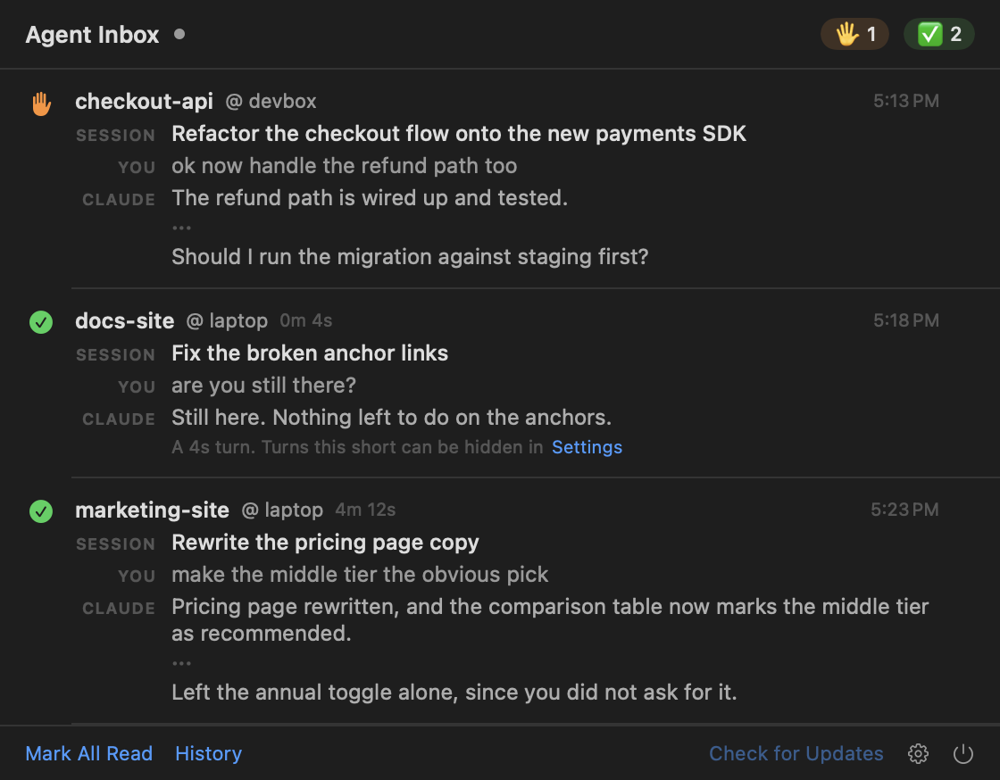
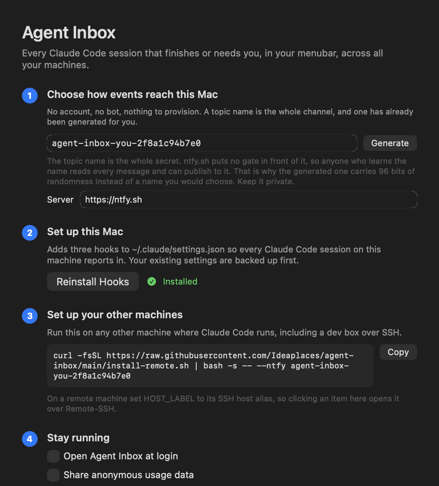
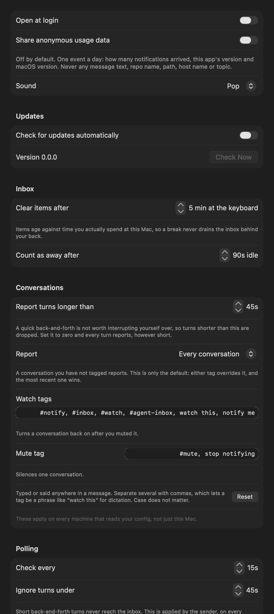
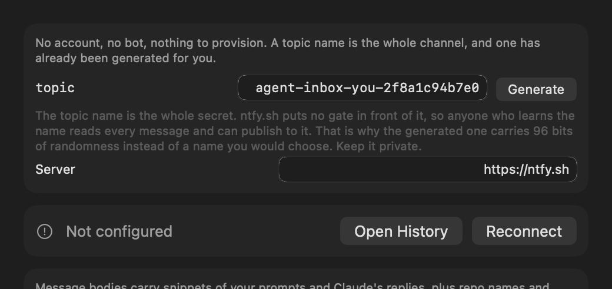
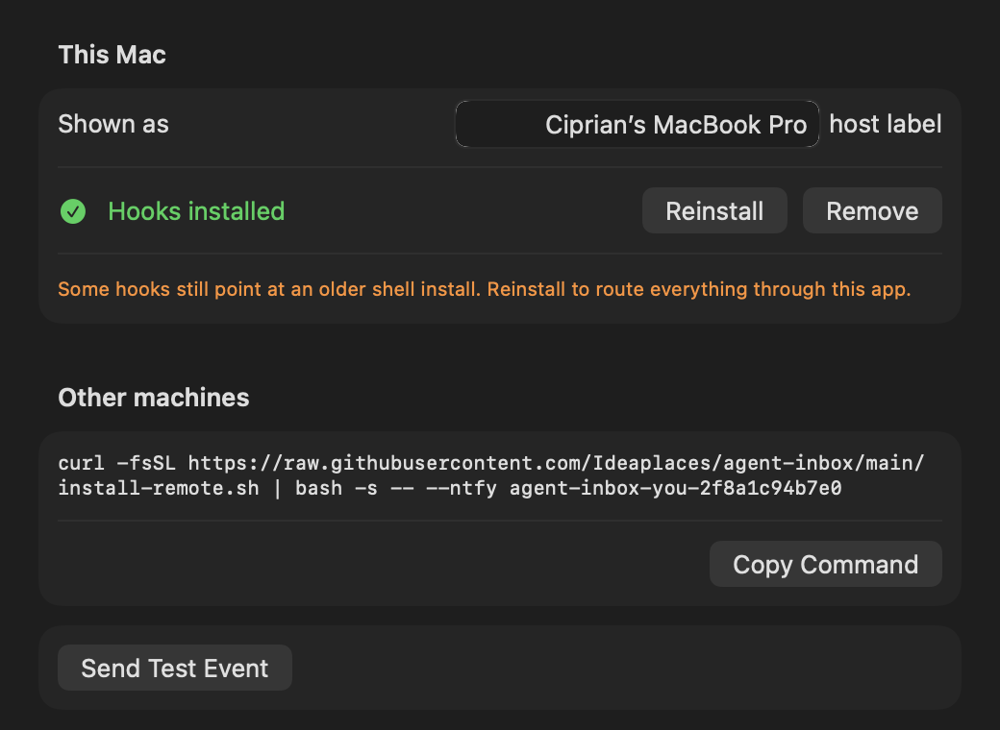

# Agent Inbox

[](https://github.com/Ideaplaces/agent-inbox/releases/latest/download/AgentInbox.dmg)
[](#install)
[](LICENSE)

**Native Mac notifications for every Claude Code session that finishes or needs you, across all your machines.**

If you run several Claude Code sessions in parallel, some local and some over SSH on a dev
box, the bottleneck isn't the agents. It's remembering who finished what, and who is sitting
blocked on a permission prompt. Agent Inbox turns that around: sessions interrupt *you*.

- 🖐️ **Needs you.** An agent hit a permission prompt, or ended its turn on a question.
- ✅ **Finished.** A turn completed, with how long it took and how it ended: the first
  sentence of the agent's answer and the last one.
- 🧵 **Context on every message.** What the conversation is about, what you last asked, and
  what the agent said back, so a ping from a two-day-old session still rings the right bell.
- **One row per conversation.** A newer message retires the older ones from the same
  session, so the list says where each conversation is rather than every step it took.
- **Typing clears it.** Start writing in a conversation and its row goes on its own. You
  are already there; it has nothing left to tell you.
- **A sticky menubar inbox.** A `🖐️2 ✅3` badge that stays until you mark it read. Go for
  coffee, come back, see who's waiting.

A native menubar app on the Mac, plain bash on every machine that sends. No server to run
and no account required.



```
senders (Claude Code hooks)        transport            surface (your Mac)
───────────────────────────   ──────────────────   ─────────────────────────
laptop sessions   ─ notify.sh ─┐                   ┌─ native notifications
dev-box sessions  ─ notify.sh ─┼─→   ntfy topic   ─┤
any other machine ─ notify.sh ─┘                   └─ menubar inbox
```

The **transport** is just the channel your machines post to and your Mac reads from. There
is no Agent Inbox server: it is [ntfy](https://ntfy.sh), either the free public one or your
own.

## Install

You need Claude Code already working, and macOS 14 or newer for the app.

### 1. Your Mac

Either one. There is no difference in what you end up with.

**Download**

Get [**AgentInbox.dmg**](https://github.com/Ideaplaces/agent-inbox/releases/latest/download/AgentInbox.dmg),
open it, and drag Agent Inbox onto the Applications folder next to it. That link always
serves the newest version. It is signed and notarized, so it opens with no Gatekeeper
warning and updates itself from then on.

**Homebrew**

```bash
brew install --cask ideaplaces/tap/agent-inbox
```

Either way the app opens itself and **puts itself in Login Items**, because a menubar app
that is not running is not an inbox. You never have to remember to start it, and it is
back after a reboot. Turn that off in **Settings → General** whenever you like and it stays
off; it is a default, not a policy.

A setup window appears and does three things:

1. **Picks a transport.** It defaults to ntfy and generates a private topic for you, so
   there is nothing to decide or sign up for.
2. **Wires up this Mac**, by adding three hooks to `~/.claude/settings.json`. It backs the
   file up first and leaves everything else in it alone.
3. **Gives you a one-line command** for your other machines, with a copy button.

Then restart any Claude Code sessions that were already running, so they pick up the hooks.

That is the whole install. Nothing to clone.

**Setting up a machine without clicking anything** is one command instead:

```bash
curl -fsSL https://raw.githubusercontent.com/Ideaplaces/agent-inbox/main/setup-mac.sh \
  | bash -s -- --ntfy <topic>
```

It installs, configures the transport, writes the hooks, registers the login item and
launches, driving the same code the setup window does through the app's CLI flags. It falls
back to downloading the release DMG when Homebrew is not installed. Teams on Azure Key
Vault can use `--keyvault <name>` instead and skip handling secrets entirely.

### 2. Your other machines

Run the command the app gave you on any other machine where Claude Code runs, including a
dev box you only reach over SSH. It looks like this:

```bash
curl -fsSL https://raw.githubusercontent.com/Ideaplaces/agent-inbox/main/install-remote.sh \
  | bash -s -- --ntfy <your-topic> --host-label <name-for-this-machine>
```

It needs `bash`, `curl`, and `jq`, and nothing else. No login, because the topic itself is
the credential.

`--host-label` is how you tell machines apart in a notification title, so use something you
will recognise. The machine's SSH host alias is the natural choice.

Restart any running Claude Code sessions there too.

> **Give each person their own transport.** Message bodies carry snippets of your prompts
> and Claude's replies. If two people share a topic or a webhook, they each read the
> other's sessions, in both directions.

## The transport

**There is nothing to choose and nothing to set up. Skip this section.**

[ntfy.sh](https://ntfy.sh) is a free, open-source pub/sub service. There is no signup, no
bot and no webhook: a channel is just a topic name.

That is also the security model, so it is worth being exact about who holds the secret:

| Server | What keeps other people out |
|---|---|
| ntfy.sh | The topic name, and nothing else. |
| Your own, no token | The topic name, and nothing else. |
| Your own, token set | The token. On a server running `auth-default-access: deny-all`, knowing the topic grants nothing. |

On the first two rows the topic name *is* the password. That is why the app generates
`agent-inbox-<you>-<24 hex digits>` for you, 96 bits of randomness, instead of letting you
invent a short one: anyone who learns it reads every message you send and can publish to
it. Keep it private. The Transport pane says which of the three you are in.

What ntfy.sh does not give you is history. The public server caches messages for about 12
hours, so the menubar inbox is your record, not the feed.

[Self-hosting ntfy](https://docs.ntfy.sh/install/) changes both of those. Set `NTFY_SERVER`
to your instance and keep as much history as you want. If it runs `auth-default-access:
deny-all`, set a token. The app takes one in **Settings**, or with
`--configure --transport ntfy --topic <t> --server <url> --token <tk>`. It is stored in the
Keychain and mirrored to `~/.agent-inbox/ntfy-token` for the bash senders. Leave it empty
for ntfy.sh, which has no accounts.

Without a token, a self-hosted server that refuses anonymous requests looks like an inbox
that simply never fills. Nothing arrives, and the status in the Transport pane turns red
with the HTTP code after two failed polls.


## What a notification looks like

```
🖐️ my-app @ devbox
🧵 Refactor the checkout flow to use the new payments SDK   <- conversation summary
🗣 ok now handle the refund path too                        <- your latest message
Claude needs your permission to use Bash                    <- why it pinged
❯ Refunds are wired up. … Should I run the migration        <- how it ended
   against staging first?
```

**The last line is the agent's own words, reduced to two sentences: the one that opened
its answer and the one that closed it,** joined by an ellipsis. A ✅ carries the same thing
under a 💬. It is there because a subject line stops being enough to recognise a
conversation you left two days and several hundred thousand tokens ago, and because the
part worth reading is usually the end, which is exactly what a truncated message loses.
Fenced code, tables and list markers are skipped, since a closing line of `};` identifies
nothing.

Three hooks produce these:

| Hook event | Meaning | What you get |
|------------|---------|--------------|
| `UserPromptSubmit` | You handed work to the agent | Nothing. It just records a start time |
| `Stop` | The agent finished its turn | **✅** with the duration and its closing words, the first and last sentence of what it said. Turns shorter than **Settings → General → Report turns longer than** (45s by default) are dropped, so quick back-and-forth doesn't spam you |
| `Notification` | The agent needs permission, or has gone idle | **🖐️** with the reason and what it just asked. A permission prompt always reports. The idle timer fires 60s after *every* turn, so it only reports when the agent's closing line was a question; otherwise the ✅ already said it |

**A short turn reports nothing, and that is the setting people meet first.** Saying "hello"
to an agent and getting no notification looks exactly like the app not working. It is the
45-second floor, and it is now **Settings → General → Report turns longer than**. Set it to
zero and every turn reports, however short. It applies to the machine you set it on, so a
dev box you report from needs its own.

**Settings are a page inside the menu, not a window.** Click the gear and the popover shows
them, with a way back. This is deliberate: a separate Settings window opens wherever macOS
decides to put it, which on a Mac driving a full-screen app is another Space, so the click
appears to do nothing at all.

**Clicking an item clears it.** There is deliberately no jump-to-session: a notification
carries only the first eight characters of the session id, and `claude --resume` needs the
whole one, so anything a click could open would be the wrong window.

**Items expire on keyboard time, not wall time.** An item clears after you have actually
been at the Mac for a while (five minutes by default, in **Settings → Inbox**), so while you
work the list stays short instead of piling into noise. The clock stops when you step away,
so a coffee-break backlog is still waiting when you get back, and only starts draining once
you are. Set it to `Never` to keep everything until you hit Mark All Read.

## Choosing which conversations report

By default every conversation reports. Twenty sessions open and one you actually
care about is a different problem, so a conversation can be tagged from inside
itself. Type any of these anywhere in a message:

| You type or say | Effect |
|---|---|
| `#notify`, `#inbox`, `#watch`, `#agent-inbox`, or "watch this", "notify me" | This conversation reports |
| `#mute`, or "stop notifying" | This conversation goes quiet |

**The spoken forms are there because dictation cannot produce a `#`.** Saying
"hashtag notify" does not become `#notify` in any dictation tool worth using, so
a tag you can only type is a tag a voice user cannot reach. "Watch this one" is
easy to say and works the same way.

The most recent tag wins, so you can flip a conversation on and off as often as
you like, and it works on a conversation that is already running. Case does not
matter. Nothing else to remember: no session ids, no separate command.

**The tags are yours to choose.** Change them in **Settings → Conversations**.
Separate several with commas, which is what lets a tag be a phrase with spaces in
it. Without a comma they are separated by whitespace, so `#a #b` still means two
tags. Emptying the watch tags restores the defaults rather than leaving a silence
nothing could escape.

**Settings → Conversations → Report** switches the default for a conversation you
have not tagged. That is all it does: both tags stay live in either mode, and a
tag always beats the default.

- **Every conversation.** An untagged conversation reports. `#mute` silences one,
  and a watch tag turns that one back on.
- **Only tagged conversations.** An untagged conversation stays silent. A watch tag
  is the only thing that makes one report, and `#mute` silences one you had tagged.
  This is the setting for "I have twenty open and want one of them."

The mode is per machine, so a dev box can stay quiet while your laptop reports
everything.

It costs nothing to check. The hook that fires when you submit a prompt is handed
the text you typed, so the tag is read from that and the answer is remembered per
session. A transcript can be tens of megabytes and is never opened for this.

The match is a plain substring, so a tag inside pasted code counts too. That is a
deliberate choice: nobody is harmed by a conversation they did not mean to watch,
and the alternative is parsing that gets clever and then gets it wrong.

## Your conversation content travels through the transport

Notification bodies include snippets of your prompts and Claude's replies, plus repo names
and working directory paths. So:

- **ntfy:** treat the generated topic like a password. Anyone who has it can read your
  messages. Self-host if that isn't good enough, and add a token so the topic name grants
  nothing on its own.
- Either way, think twice if you work on sensitive codebases.

## Anonymous usage data, off by default

Nothing about your usage leaves your Mac unless you switch it on, in
**Settings → General** or with the unticked box in the setup window.

Switched on, the app sends **one event a day**, and this is all of it:

```json
{
  "app_version": "0.1.26",
  "macos_version": "26.0",
  "notifications_finished": 41,
  "notifications_needs_you": 3,
  "watch_mode": "all",
  "self_hosted": true,
  "custom_tags": false
}
```

It is keyed on a random id generated when you turn it on, and discarded when you turn it
off. Turning it off and on again makes a new one, so it cannot be used to follow you across
that.

**The key list above is the whole contract, and a test enforces it.** Every value is a
count, a flag or a version number. There is nowhere in the event for a message, a repo
name, a directory path, a host label, a session id, your topic or your token, because none
of those are ever assembled in the first place. Adding a key means editing the test, which
is the moment somebody has to ask whether it describes a person.

**The senders send nothing.** `notify.sh` runs as a hook on every turn on every machine and
must never block a session, so there is no analytics call anywhere in that path. The
counting happens in the Mac app, which already sees every message.

**One event a day rather than one per notification,** because a per-message event would be
a record of the hours you work. A daily total answers how much the thing reports and
describes nobody's day.

## Updates

The app checks once a day and installs updates itself
([Sparkle](https://sparkle-project.org), EdDSA-signed, so it only installs a build signed
with our key). Turn it off in **Settings → Updates**, or check on demand from the menu.

Installed with Homebrew? `brew upgrade --cask agent-inbox` works too. Either path is fine.

## What it looks like

Setup, which is the whole of it: a topic is already generated, and the two buttons install
the hooks here and give you the line to paste on your other machines.



Settings, in three tabs.







## Config

The app owns its own settings, in **Settings**. The only file you might touch is
`~/.agent-inbox/config`, which the bash senders read:

```bash
MIN_SECONDS=45                  # ignore turns shorter than this
WATCH_MODE=all                  # or "tagged": report only tagged conversations
WATCH_TAGS="#notify, #inbox, watch this"   # tags that turn a conversation on
MUTE_TAG="#mute, stop notifying"           # tags that silence one
HOST_LABEL="mac"                # machine name shown in messages
NTFY_SERVER="https://ntfy.sh"   # a self-hosted ntfy instance
```

The ntfy token is deliberately not in here. `config` is written world-readable so a sender
running as another user can read it, so the token lives in `~/.agent-inbox/ntfy-token` at
`0600` instead. Switching transport removes the files belonging to the one you left, because
`notify.sh` posts to whatever it finds: a leftover config is not inert, it keeps sending.

These are sender-side only, and the app writes them itself so the two can never disagree,
including `MIN_SECONDS`, which **Settings → General → Report turns longer than** writes
here. Poll interval, sound, expiry, idle threshold and usage sharing are app-side and live in
Settings. Usage sharing is deliberately not in this file: the senders never report anything,
so there would be nothing for them to read.
Notifications play **Pop** by default; **Settings → General → Sound** changes it, and
`Silent` turns it off.

A banner that never makes a sound is easy to miss entirely, so if you are getting nothing:
check **System Settings → Notifications → Agent Inbox**, and check whether a **Focus** mode
is filtering it. A Focus can silence an app while the notification API still reports sound
as enabled, so nothing in the app can warn you about it.

Runtime state also lives in `~/.agent-inbox/`: `bin/notify.sh` (unpacked from the app),
the sender's transport config, `state/<session>.start` (turn timers), `presence` (seconds
clocked at the keyboard), and `items.json` (the inbox itself).

## How it works

The app adds three hooks to `~/.claude/settings.json`. It is idempotent, it backs the file
up first, and it leaves your other hooks and settings untouched. On `Stop` and
`Notification`, `notify.sh` reads the session transcript, pulls out the context lines, and
posts to your transport. The Mac app polls that transport, raises a native notification, and
keeps the item in the menubar inbox until you read it or it ages out.

`notify.sh` ships inside the app bundle and is unpacked to `~/.agent-inbox/bin/notify.sh`,
so hooks keep working when the app is moved, updated or quit, and a session that fires a
hook while the app is closed still reaches the transport. Secrets the app owns, the bot
token and webhook URL, live in the login Keychain rather than on disk.

**Requirements:** senders need `bash`, `jq` and `curl` on any OS Claude Code runs on. The
Mac app needs macOS 14 or newer and nothing else.

**Building it yourself:** see [mac/README.md](mac/README.md). It is `./mac/build.sh` plus a
Swift toolchain.

## Uninstall

**Settings → Machines → Remove** takes the hooks back out; the original file is kept at
`~/.claude/settings.json.bak.agent-inbox`. Then quit the app, drag it to the Trash, and
`rm -rf ~/.agent-inbox/`.

On a sending machine, restore the backup the installer left and remove the state:

```bash
mv ~/.claude/settings.json.bak.agent-inbox ~/.claude/settings.json
rm -rf ~/.agent-inbox
```

## Without the Mac app

The senders are plain bash and work on their own, so you can skip the app entirely and read
the transport's history as your inbox. Clone the repo and run
`./install.sh --ntfy <topic>` for the hooks and nothing else.

There used to be a SwiftBar-based Mac surface here. It is gone: the app replaced it and
running both delivered every event twice. If you still have it installed, retire it:

```bash
launchctl unload ~/Library/LaunchAgents/com.agent-inbox.watcher.plist
rm ~/Library/LaunchAgents/com.agent-inbox.watcher.plist
rm "$(defaults read com.ameba.SwiftBar PluginDirectory)/agent-inbox.5s.sh"
```

The app adopts your existing `~/.agent-inbox/` config on first launch, so there is nothing
to retype, and your old `config` is kept as `config.bak.agent-inbox`. Installing hooks from
the app also replaces any hook pointing at an older `notify.sh`, so you never end up with
two copies of every event.

## Roadmap

Cloud and remote agents in the same inbox.

## License

MIT
